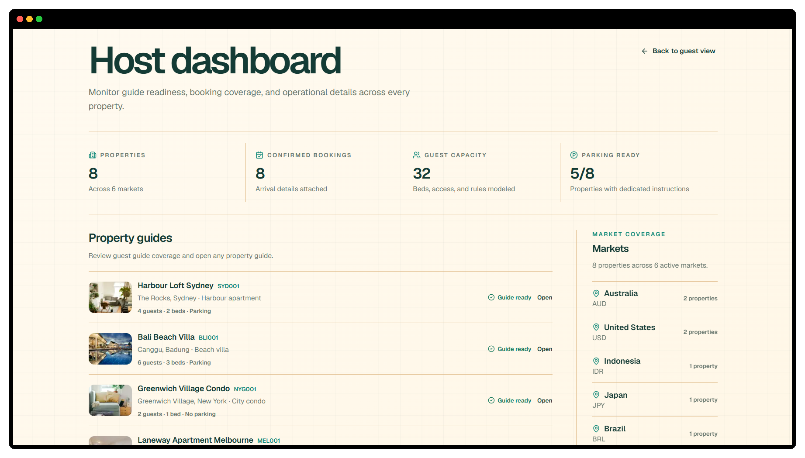

# Hosthing

Guests should not need to message a host at midnight to ask for the WiFi password.

Hosthing gives every property a shareable guest guide with arrival information, house rules, local recommendations and AI-powered stay support.

[Open the live demo](https://hosthing.vercel.app) · Fictional properties and reservations

## Why I built it

Short-term rental hosts answer the same questions repeatedly: how to enter, where to park, when to check out and what is nearby.

I built Hosthing to put those answers in one property-specific guide while keeping private reservation and arrival details behind signed, expiring guest links.

The AI assistant uses the property, reservation and local-guide context available for that stay. When the information is missing or access is not valid, it refuses to invent an answer.

## How it works

- Property codes load a dedicated mobile guest guide.
- Signed reservation links unlock private arrival and booking details.
- Local recommendations are generated, validated and persisted in PostgreSQL.
- Guest questions are answered using only the context available for that property and stay.
- Deterministic fallbacks keep essential support working when AI generation is unavailable.

## Built with

**Frontend:** Next.js, React, TypeScript and Tailwind CSS  
**Data:** PostgreSQL, Prisma and Zod  
**AI:** Vercel AI SDK and OpenAI  
**Testing and delivery:** Vitest, Vercel and GitHub Actions

The public repository uses fictional guest and property data. Authenticated property management and the complete commercial workflow remain outside the demo.
